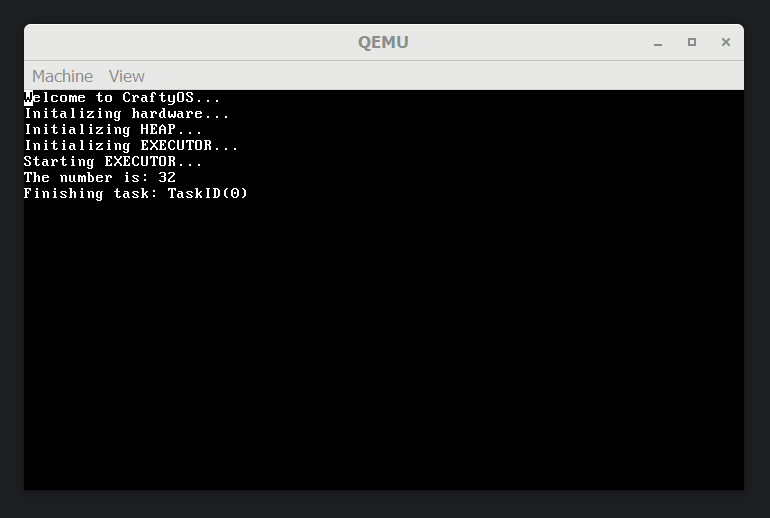
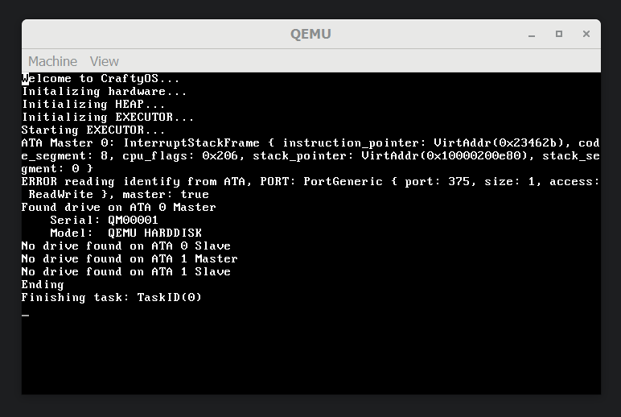
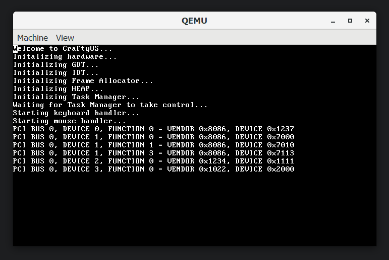

## Multitasking via async/await
Multitasking is an important step in making a functional OS. There are 2 models that I could employ, cooperative and preemptive multitasking. Cooperative is easier to implement because tasks voluntarily give up time to allow to scheduler to spawn the next task. Benefits of Cooperative multitasking include a smaller resource footprint because tasks can save what it needs before switching, whilst the preemptive model must save everything as the kernel has no way of knowing what the task will need to keep. However a single task can run for a potentially infinite time by not passing control back to the scheduler. Since the cooperative model is easier to implement I implemented it in the holidays. Next week I will create a preemptive scheduler.

### How does async/await work?
The specific intrinsics are dependent on the language, however for Rust there are 3 things that must be created, an Executor, a Waker and Tasks. When each task is Polled it will try and run to completion if it reaches a bottleneck where it must wait, such as reading from a disk, it yielded it's time slice etc, it returns ```Poll::Pending``` this tells the executor that is must try again later. Alternatively the process returns ```Poll:Ready(())``` , the executor can then remove the task from the task list. But how does the Executor know to try a process again, we could simply add the task to the end of the queue however Rust employs a tactic known as the Waker, when a task must wait it passes a Waker which fundamentally will tell the Executor that the task can do more work. This system works because the waiting will likely be solved by another thread or an interrupt which can then call the Waker and in time the task can continue processing the data.

### Basic Task
The example shown in the code snippet spawns a task which then waits for an asynchronous number to be resolved and then prints it out to the screen. This demonstrates how async tasks can wait on their own nested tasks making a tree of async tasks.

```rust
/// Returns an async number
/// Simulates an IO wait by yielding immediatly
async fn get_async_number() -> u8 {
	yield_now().await;
	32
}

/// Gets an async number and prints it to the screen
async print_number() {
	let number = get_async_number().await;
	println!("The number is: {}", number);
}

fn main(boot_info: &'static BootInfo) -> ! {
	// Initalization code
	// ...
	
	// The executor which will run all our tasks
	println!("Initializing EXECUTOR...");
	let mut executor = Executor::new();
	
	// The spawner is a thread safe spawner
	// It can be passed to tasks so that tasks can spawn new tasks
	let spawner = executor.get_spawner();

	spawner.spawn(Task::new(print_number()));

	// Start the executor
	println!("Starting EXECUTOR...");
	executor.run()

	// The kernel main cannot end so infinite loop
	loop { unsafe { asm!("hlt") } }
}
```

### Async Keyboard
I also implemented a scan code stream for the keyboard which appended keystrokes to an array and then notifies the Executor that the keyboard task can keep doing work. A benefit of this is that as shown in the below code snippet the Keyboard can be a local variable instead of a Global static. Another benefit is all the keyboard handling code is run outside the interrupt loop, allowing interrupts to be processed as quickly as possible.

```rust
pub async fn print_keypresses() {
    let mut scancodes = ScancodeStream::new();
    let mut keyboard = Keyboard::new(Us104Key, ScancodeSet1, HandleControl::Ignore);

    println!("Starting keyboard handler...");

    // This loop should never return
    while let Some(scancode) = scancodes.next().await {
        // Process the next scancode
        if let Ok(Some(key_event)) = keyboard.add_byte(scancode) {
            // If there is a new key available
            if let Some(key) = keyboard.process_keyevent(key_event) {
                // Print out the key to the screen
                match key {
                    DecodedKey::Unicode(character) => print!("{}", character),
                    DecodedKey::RawKey(key) => print!("{:?}", key),
                }
            }
        }
    }
}
```

## Disk IO via ATA

### How does ATA work?
To read/write to an a disk you must first know which ATA bus it is connected to. There are 4 locations ATA 0 Primary/ Secondary and ATA 1 Primary/ Secondary. Then you can ask the device to read or write bytes to the disk, afterwords you can either poll the disk until it says ready (which is what I implemented) or you can ask it send you an interrupt when it is ready. Once the drive is ready you can read/write **all** 512 bytes from the sector, it is important that all 512 bytes are used otherwise the drive might malfunction. 

### Disk enumeration
To enumerate each disk I identified each of the 4 ATA drives and then printed it's disk name if there was a disk connected as shown in the snippet and screenshot below. The ERROR shown in the screenshot is because there was no disk connected to ATA 1. 



```rust
fn read_disks() {
	// ATA 0 lives on IO port 0x1F0
	let mut ata_0_master = ATA::new(0x1F0, true);
	let mut ata_0_slave  = ATA::new(0x1F0, false);
	// ATA 1 lives on IO port 0x170
	let mut ata_1_master = ATA::new(0x170, true);
	let mut ata_1_slave  = ATA::new(0x170, true);
	
	// Indentify disks
	let ata_0_master_info = ata_0_master.identify(Vec::with_capacity(512));
	let ata_0_slave_info = ata_0_slave.identify(Vec::with_capacity(512));
	let ata_1_master_info = ata_1_master.identify(Vec::with_capacity(512));
	let ata_1_slave_info = ata_1_slave.identify(Vec::with_capacity(512));

	// Print info for each disk
	for (ata_info, name) in [
		(ata_0_master_info, "ATA 0 Master"),
		(ata_0_slave_info, "ATA 0 Slave"),
		(ata_1_master_info, "ATA 1 Master"),
		(ata_1_slave_info, "ATA 1 Slave"),
	] {
        // Was there a disk on this bus
		if  let  Some(info) =  ata_info {
			println!("Found drive on {}", name);
			println!(
				" Serial: {}\n Model: {}",
				str::from_utf8(&info.serial).unwrap_or("INVALID SERIAL"),
				str::from_utf8(&info.model).unwrap_or("INVALID MODEL"),
			);
        } else {
            println!("No drive found on {}", name)
        }
	 }
}
```
### Interrupts Challenge
Initially this code created a DOUBLE_FAULT exception in QEMU but worked in VirtualBox. This made me think that the drive was sending an interrupt which caused the crash as I wasn't handling it. Eventually I found out that the interrupts were at interrupt number 14 and 15, however I wasn't able to set them. The reason for this was that they were offsets from the PIC chip which meant that they started at offset 0x20. With this change the interrupt handlers worked and in QEMU I got an interrupt and was able to continue execution.

## PCI Enumeration
To enumerate the PCI devices in quite simple, you use for loops. In this code snippet below, we ask each PCI device to tell us its infomation. If none exists on that address a 0 or 0xFFFF is returned. I used wyoos [PCI enumeration](https://www.youtube.com/watch?v=GE7iO2vlLD4&list=PLHh55M_Kq4OApWScZyPl5HhgsTJS9MZ6M&index=11) tutorial as a starting point for this section. 

This code snipped shows how I went about enurmerating the PCI devices. The screenshot below also shows that it successfully works.
```rust
pub fn select_drivers(&mut self) {
	for bus in 0..8 {
		for device in 0..32 {
			for function in 0..8 {
				// Get device info
				let mut dev = self.get_device_descriptor(bus, device, function);

				if dev.vendor_id == 0x0000 || dev.vendor_id == 0xFFFF {
					// There is no function here :(
					continue;
				}

				// Enermuerate over each base address that the device has
				for bar_num in 0..6 {
					let bar =
						match self.get_base_address_register(bus, device, function, bar_num) {
							Some(bar) => bar,
							None => continue,
						};

					// Ensure there is an address
					// We currently only have support for IO not mmap
					if bar.address != 0
						&& (bar.register_type == BaseAddressRegisterType::InputOutput)
					{
						dev.port_base = bar.address.into()
					}
				}

				println!(
					"PCI BUS {}, DEVICE {}, FUNCTION {} = VENDOR {:#X}{:X}, DEVICE {:#X}{:02X}",
					bus & 0xFF,
					device & 0xFF,
					function & 0xFF,
					(dev.vendor_id & 0xFF00) >> 8,
					dev.vendor_id & 0xFF,
					(dev.device_id & 0xFF00) >> 8,
					dev.device_id & 0xFF
				);
			}
		}
	}
}
```


## Timeline update
In the holidays I completed many of the tasks from my [Timeline](https://craftydh.github.io/CraftyOS-Blog/posts/restart/#revised-timeline). However as stated earlier the USB spec is over 600 pages and as such I will be skipping it. As cooperative multiasking has it's weeknesses next week I will work on preemtive multitasking instead of moving onto creating a filesystem.
