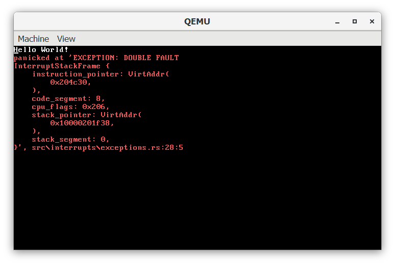
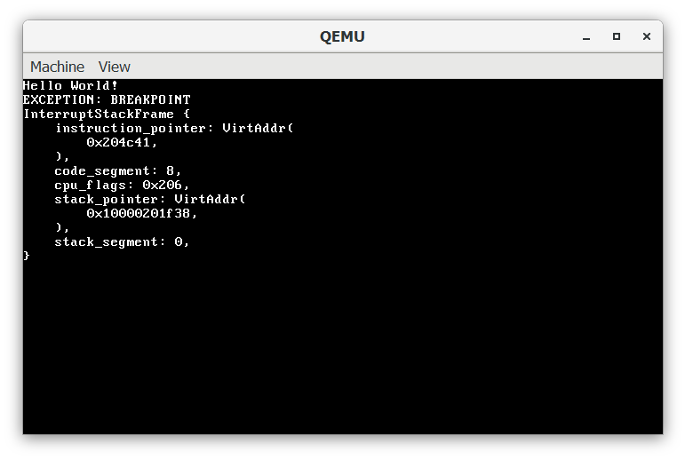
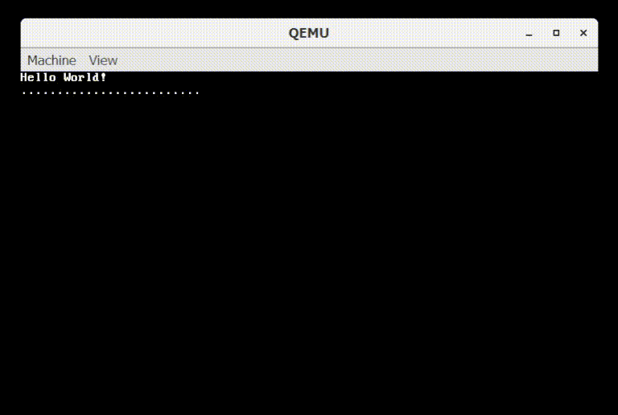
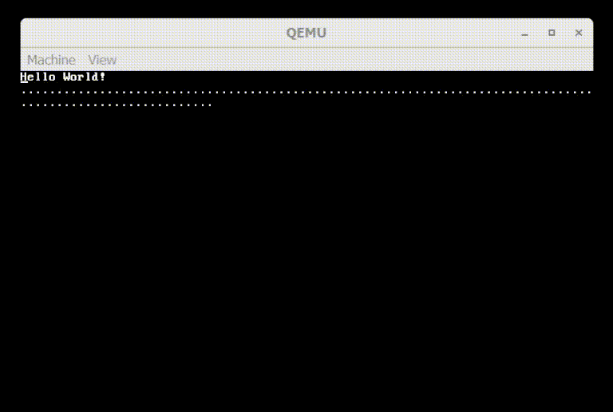

## Interrupts

Interrupts are essential to a computer functioning, they allow your keyboard and mouse to interrupt the CPU and tell it that an event is waiting. This means that when a program is running the kernel gets control of the CPU so that it can process the keyboard event. This also enables the CPU to tell us when we do something stupid such as dividing 0 by 0.

### Timeline

In this week the interrupts and exceptions were quite easy to write with Phillop's tutorials help. As a result I also didn't have any notable challenges. The project is on track with the [Timeline](https://craftydh.github.io/CraftyOS-Blog/posts/restart/#revised-timeline) and I will begin work on paging and memory next week.

## Exceptions

To handle exceptions we must first program the IDT and GDT, checkout Phillip's tutorial for more on those. Then we can program handler function for the exceptions. To create a external function for the interrupts I used rust's FFI for `x86-interrupt`. This image below shows a double fault because we don't have a break-point handler.

To fix this we create a breakpoint handler which will show us where the code had a breakpoint, as well as where the stack is. This would allow us in the future to be able to change the stack and monkey patch code, for debugging purposes. An example breakpoint stack frame is shown below.

## Timer

As the timer always goes and we currently have nothing to time, the OS just prints a "." to the screen. In the near future, this could be used for multitasking in-order to switch tasks. I could also make a program that acts as a timer or a stopwatch. As shown in the gif below the timer outputs quite a few interrupts per second.

## Keyboard

For a PS2 keyboard an interrupt is fired every time a key is pressed. Thankfully for us QEMU emulates a PS2 keyboard using your hosts keyboard interface. However do the the complexities of their being over 3 different common scan-code sets, I opted to use a library to process the keyboard interrupts and return the ASCII character. As shown below the keyboard interrupts appear asynchronously along with the timer.
 
