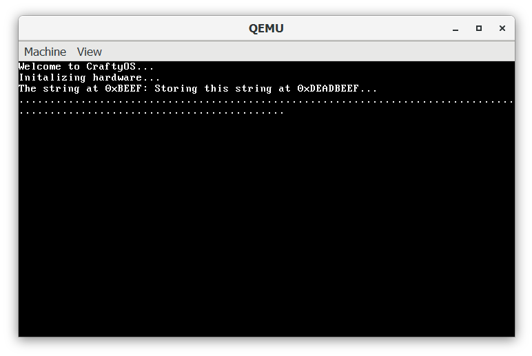
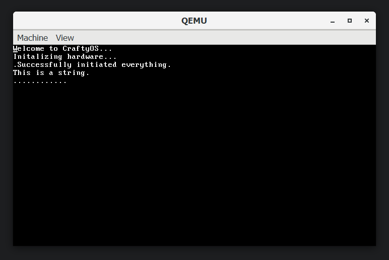

## Memory

Memory is an essential component to a functioning OS, it allows for dynamic content such as strings and other data types which need to be stored on the heap. Therefore mapping will first need to be implemented to be able to read and write to virtual memory locations which are stored at some other physical memory location. After this a Global Allocator which takes a page and builds a heap on it, for these purpose a linked list allocator will be used for allocations over 2 MiB, and a Fixed Size Allocator for smaller allocations allowing for fast allocations.

### Timeline
In this week the Paging and Global Allocator were quite easy to write due to the help of Phillop's tutorials help. As I have successfully completed all taskes set out in the [project's timeline](https://craftydh.github.io/CraftyOS-Blog/posts/restart/#revised-timeline), i am currently on track to begin work on Multitasking next week.

## Mapping
To handle paging I first needed to get the bootloader to pass a MemoryMap that was taken from the BIOS. This MemoryMap shows what is currently stored in every chunk of memory, such as hardware used memory or where the kernel was loaded. With this I wrote a mapper that tells the CPU the new mappings. An example where I wrote a string to 0xDEADBEEF and read it back from 0xBEEF is as follows. 

```rust
// Map 0xDEADBEEF to 0xBEEF
let virtualAddr = Page::containing_address(VirtAddr::new(0xDEADBEEF));
let physicalAddr = PhysFrame::containing_address(PhysAddr::new(0xBEEF));
// Create the mapping
memory::create_mapping(virtualAddr, &mut mapper, physicalAddr, &mut frame_allocator);

unsafe {
	// Write string to the raw pointer
	*(0xDEADBEEF  as  *mut  &str) =  "Storing this string at 0xDEADBEEF...";
	// Read string from the raw pointer
	println!("The string at 0xBEEF: {}", *(0xBEEF  as  *mut  &str));
}
```

When I run this is Qemu the expected output is that we can read the same value from the other address, and thats what we see!



## Global Allocator

For the Global Allocator, I implemented three different implementations. Firstly a [bump allocator](https://os.phil-opp.com/allocator-designs/#bump-allocator) which provides fast performance, however memory can't be freed unless everything is freed due to it not tracking which memory it allocates to each process. Secondly a [linked list allocator](https://os.phil-opp.com/allocator-designs/#bump-allocator) which allows for tracking free space, however due to it having to track the entire list to find a suitable location a third type was implemented. The third type is a [fixed size allocator](https://os.phil-opp.com/allocator-designs/#fixed-size-block-allocator), this is functionally very similar to a linked list allocator except each chunk is a fixed size, this allows fast allocations as the first available block can be popped of the list. A linked list allocator is used behind this the allocate more fixed size blocks if needed and for blocks over 2 KiB as those a rare.

In the following example I create a string (which is stored on the heap) and append various strings to it, this shows that the heap works and can grow an allocation. 
``` rust
let mut string = String::from("This");
let variable = " is";
string += variable;
string += " a";
string += " string.";

println!("{}", string);
```
The expected output should be the string "This is a string." and as shown in the following image that is what we see!



## Challenges

The biggest challenge that I had was t