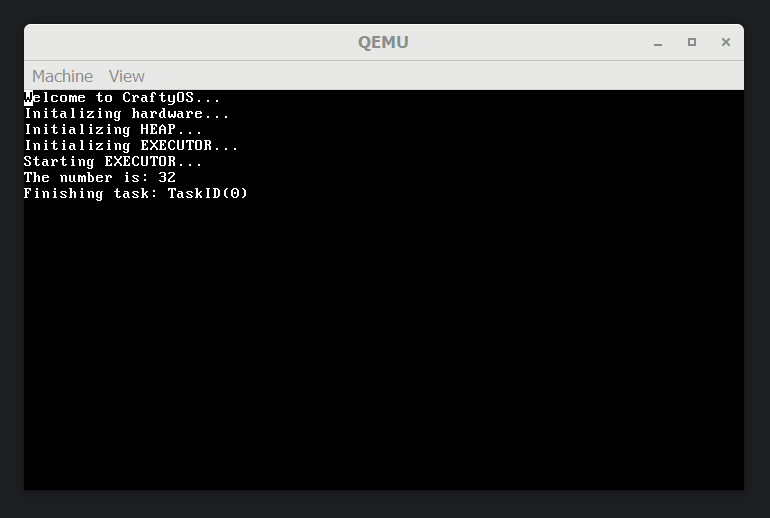

## Multitasking via async/await
Multitasking is an important step in making a functional OS. There are 2 models that I could employ, cooperative and preemptive multitasking. Cooperative is easier to implement because tasks voluntarily give up time to allow to scheduler to spawn the next task. Benefits of Cooperative multitasking include a smaller resource footprint because tasks can save what it needs before switching, whilst the preemptive model must save everything as the kernel has no way of knowing what the task will need to keep. However a single task can run for a potentially infinite time by not passing control back to the scheduler. Since the cooperative model is easier to implement I implemented it in the holidays. Next week I will create a preemptive scheduler.

### How does async/await work?
The specific intrinsics are dependent on the language, however for Rust there are 3 things that must be created, an Executor, a Waker and Tasks. When each task is Polled it will try and run to completion if it reaches a bottleneck where it must wait, such as reading from a disk, it yielded it's time slice etc, it returns ```Poll::Pending``` this tells the executor that is must try again later. Alternatively the process returns ```Poll:Ready(())``` , the executor can then remove the task from the task list. But how does the Executor know to try a process again, we could simply add the task to the end of the queue however Rust employs a tactic known as the Waker, when a task must wait it passes a Waker which fundamentally will tell the Executor that the task can do more work. This system works because the waiting will likely be solved by another thread or an interrupt which can then call the Waker and in time the task can continue processing the data.

### Basic Task
The example shown in the code snippet spawns a task which then waits for an asynchronous number to be resolved and then prints it out to the screen. This demonstrates how async tasks can wait on their own nested tasks making a tree of async tasks.

```rust
/// Returns an async number
/// Simulates an IO wait by yielding immediatly
async fn get_async_number() -> u8 {
	yield_now().await;
	32
}

/// Gets an async number and prints it to the screen
async print_number() {
	let number = get_async_number().await;
	println!("The number is: {}", number);
}

fn main(boot_info: &'static BootInfo) -> ! {
	// Initalization code
	// ...
	
	// The executor which will run all our tasks
	println!("Initializing EXECUTOR...");
	let mut executor = Executor::new();
	
	// The spawner is a thread safe spawner
	// It can be passed to tasks so that tasks can spawn new tasks
	let spawner = executor.get_spawner();

	spawner.spawn(Task::new(print_number()));

	// Start the executor
	println!("Starting EXECUTOR...");
	executor.run()

	// The kernel main cannot end so infinite loop
	loop { unsafe { asm!("hlt") } }
}
```

### Async Keyboard
I also implemented a scan code stream for the keyboard which appended keystrokes to an array and then notifies the Executor that the keyboard task can keep doing work. A benefit of this is that as shown in the below code snippet the Keyboard can be a local variable instead of a Global static. Another benefit is all the keyboard handling code is run outside the interrupt loop, allowing interrupts to be processed as quickly as possible.

```rust
pub async fn print_keypresses() {
    let mut scancodes = ScancodeStream::new();
    let mut keyboard = Keyboard::new(Us104Key, ScancodeSet1, HandleControl::Ignore);

    println!("Starting keyboard handler...");

    // This loop should never return
    while let Some(scancode) = scancodes.next().await {
        if let Ok(Some(key_event)) = keyboard.add_byte(scancode) {
            if let Some(key) = keyboard.process_keyevent(key_event) {
                match key {
                    DecodedKey::Unicode(character) => print!("{}", character),
                    DecodedKey::RawKey(key) => print!("{:?}", key),
                }
            }
        }
    }
}
```

## Disk IO via ATA

### Todo!

  

## PCI Enumeration

### Todo! 

