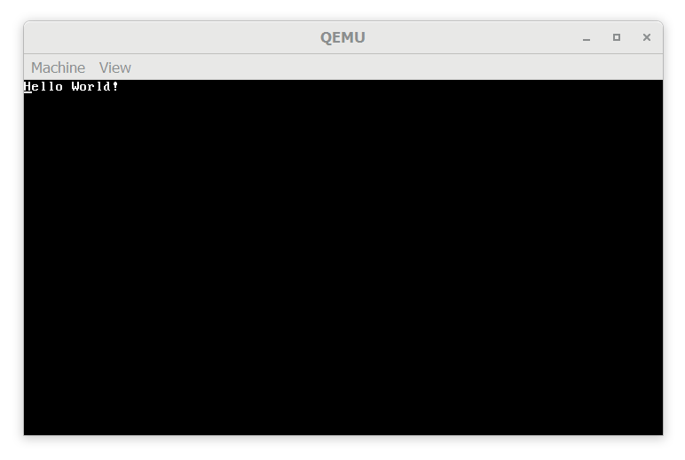

## Why must I restart

Well quite simply UEFI is a pain. But seriously I spend 72 hours rewriting and rewriting my interrupt handlers to no avail. I believe that the problem was that I could not setup paging correctly and as such caused general protection faults and as I could not handle these faults I wasted so much time. Therefore in order to catch up to my schedule I have chosen to follow Philipp Oppermann's [blog_os](https://os.phil-opp.com/) to completion and then implement the other features on top. In order to prevent my assignment from being strait up plagiarism, I will add more features and things to my OS.

## Revised Timeline

As I now must have a blog post each week, I have revised the schedule to be a weekly schedule.

1. Writing a rust BIOS application
   * VGA Text Mode
   * A testing suite
2. Exceptions and Interrupts
   * IDT / GDT
   * Exception Handlers
   * Timer Handler
   * Keyboard Handler
3. Paging / Memory
   * Map Physical Memory
   * Heap Allocator
4. Cooperative Multitasking
   * Futures
   * Async Keyboard
5. PCI / USB
   * Show all PCI and USB devices
   * Get inputs from USB bus
6. Devices
   * USB Keyboard
   * PS2 and USB Mouse
7. Storage
   * Read/Write raw bytes to hard drive
8. Filesystem
   * Program a basic filesystem such as Fat32
9. Networking
   * Raw Ethernet Frames
   * ICMP
10. More Networking
    * TCP
    * UDP
11. Terminal and Other applications
    * For the remaining time...

## Writing a rust BIOS application

As iterated earlier for this week I primarily followed Phillip's tutorial series for the beginning, however I did add a few things.

### Hello World

To begin any project you must write "Hello World", therefore a VGA buffer writer would need to be made. In the tutorial Phil started from to bottom of the screen and for scroll copied everything 1 line up, however I preferred the writer starting from the top left of the screen, as you can see in the below picture.

As with my original attempt I created a `colour!` macro to change which colour is printed to the screen which is now limited to VGA colours. Along with that I implemented a `cursor!` macro to change the writers cursor position on the screen.  Both of these features are shown bellow where I wrote some pink text at the bottom of the screen.

