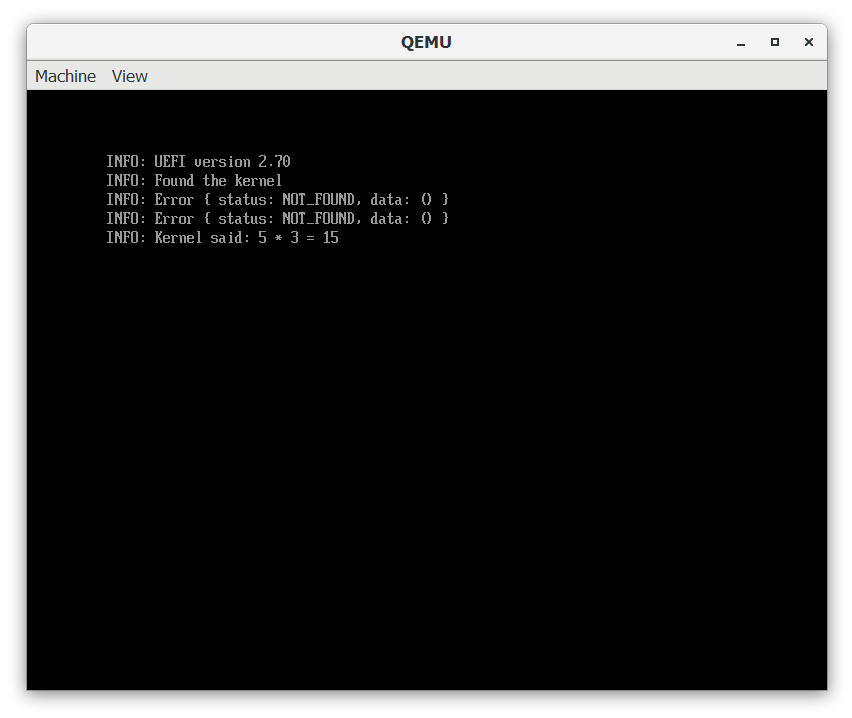
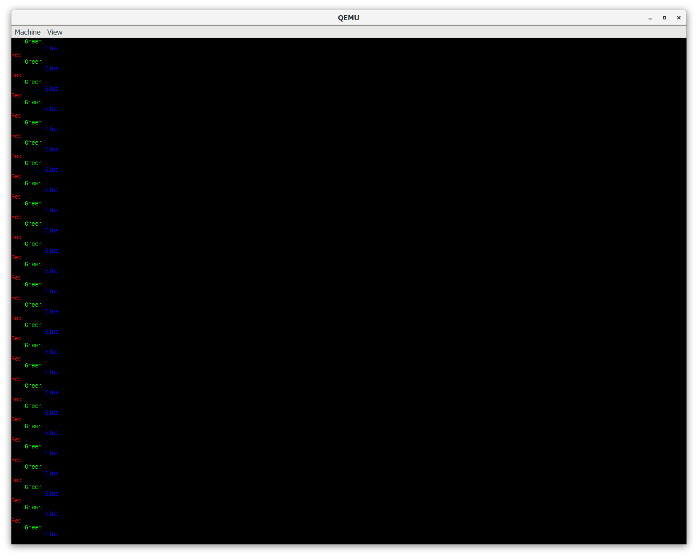

## Why make an OS?

The purpose of this project is to learn how computers work at a basic level by programming a bare bones OS. This will help myself learn the various complexities behind the OS abstractions that are used in conventional programs.

Additionally as this project is for a school project, I had the requirement of creating a digitial application in 16 weeks. With that in mind, I wanted to choose a complex topic where I could make something cool while learning another area of computer science.

## Project timeline

The following list is my current timeline. I have estimated that each step should take approximately 2 weeks for me to complete (hopefully).

1. Creating a UEFI Application. (This post)
2. Loading the IDT and GDT.
3. Interrups and PS2 keyboard and mouse.
4. PCI bus and basic USB.
5. Memory and a basic memory allocator.
6. File System.
7. Multitasking async/await.
8. Basic terminal.
9. Basic networking stack.
10. Cool things I think of as I go...

## Making a builder application

The first step in creating the UEFI application was creating a builder. This builder would need to run ```cargo build``` on the kernel/bootloader and then bundle them with the assets into a fat32 img.

The first hurdle was building the kernel and bootloader. I initally planed on using cargo workspaces to build everything, however due to [this cargo issue](https://github.com/rust-lang/cargo/issues/9451) i could not do that. Instead I recursively ran cargo build in each directory using rust's subprocess capablitites.

To create the fat32 img I employed the crate [fat32](https://crates.io/crates/fat32) which exposed a virtual filesystem object. This enabled me to simple open the files from my disk and use ```std::io::copy``` to copy the file into the img.

The final version was called using ```cargo run``` in the project root. The builder also launches qemu after a successful build.

## Making a bootloader and loading the kernel

For the bootloader I used the crate [uefi](https://crates.io/crates/uefi) to provide the UEFI types. I was also following [Poncho's](https://www.youtube.com/watch?v=mpPbKEeWIHU&list=PLxN4E629pPnJxCQCLy7E0SQY_zuumOVyZ) C tutorial as the base for my OS.

I initially had some issues with the uefi crate becuase I hadn't encounted rust type parameters used to determine the action a function should do. However once I worked out how to use the create I was able to successfully create a working bootloader.

To load the kernel into RAM I used the crate [xmas_elf](https://crates.io/crates/xmas_elf) to read the elf data into useful structs. When requesting memory from the UEFI I got a bunch of errors as shown below.



Despite this the kernel loads successfully and returns the product of 5 and 3. As such I will procede and maybe fix this if it starts breaking my kernel.

## Loading GOP and making the ```println!``` macro

As I knew how to use the UEFI crate grabbing the GOP framebuffer was easy peasy. I also added a function that would set the maximum size supported by the screen without exceding a threthhold such as 1920x1080.

When passing the GOP infomation to my kernel, I had to deal with rust lifetimes, which I had never messed with before. However it was relativily strait forward to set everthing to ```'static```.

For printing to the GOP buffer I once again used Poncho's tutorial as assistance of how to write to the memory address. However creating the ```println!``` macro proved challenging as I needed to have a static Global writer method, but I only got the GOP infomation in the kernel entry. To overcome this I made GOP an ```<Option<Gop>>``` and made the kernel set it first.

I used ```core::ptr::copy``` to copy to video buffer from the bottom to the top over itself as a very efficient scroll mechanism. I also invented a ```colour!``` macro that simply sets the hexadecimal colour that the writer uses.

To test this all out I created a for loop that prints Red, Green and Blue in their repective colours, as shown in the image below.  


