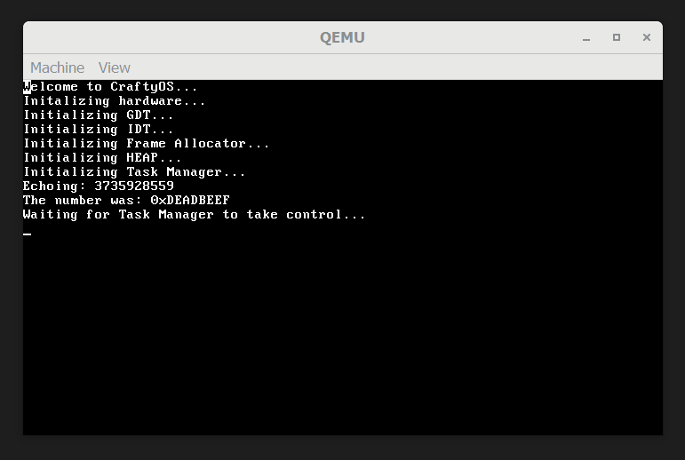
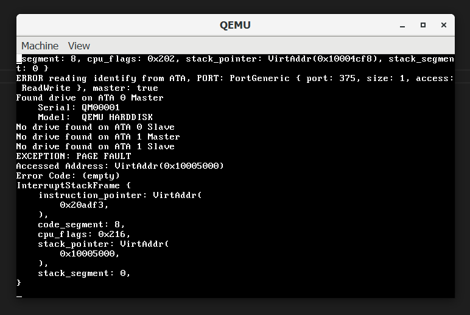

## What are syscalls
Syscalls are a process in a lower privilege level to communicate with higher privilege level code such as the kernel. There are many models for implementing such syscalls, the way I have gone for at the moment is regisiter based.

To call a syscall you must know the syscall number, and then pass the arguments to the next registers. Unfortunately this means I cannot use rust contructs such as Vec's as only C safe values can be directly passed.

## Example ECHO
In this syscall test we call the echo command which passes back the same number we send to it.

To call it we pass 0 into the command register RAX, and 0xDEADBEEF into the arg1 register r8.

The syscall will then return the number in r8 in the return register RAX.

To demonstate this the code we will run is.

```rust
unsafe {
    let mut rax = 0;
    let test_num = 0xDEADBEEF;
    asm!("int 0x80", inout("rax") rax, in(r8) test_num);
    println!("The number was: {:#X}", rax);
}
```

As expected we get to number 0xDEADBEEF printed to the console as shown below.



## Spawn Thread
This is a very usefull syscall that programs can call. It allows a process to spawn any C function as a new thread, in the thread pool. As I wanted to have closures that can capture surrounting variables to work I needed additional context other than a function pointer. To achieve this I looked into the rust source code for how they handle POSIX threads.

```rust
const SPAWN_THREAD: usize = 2;
pub fn spawn_thread<F>(func: F) -> TaskID
where
    F: FnOnce() + Send + Sync,
{
    let boxed_func: Box<dyn FnOnce()> = Box::new(func);
    let raw = Box::into_raw(Box::new(boxed_func)) as *mut usize;
    let res = unsafe { syscall1(SPAWN_THREAD, raw as usize) };
    TaskID::from(res)
}
```
In this function the passed in function is boxed onto the heap and then converted into a raw C pointer.

However, this lead to a problem. I had to call the function from rust after I reconstructed it. However, I cannot call the function within the syscall handler otherwise the Mutex will never be freed.

The solution to this was remarkably simple create a bootstrap function. The beauty in this is that I set up the CPU to start running a C function, which then is no longer constrained. Additionally when privilege levels exist the boostraper will not run under ring 0, but whichever ring level the process has.

```rust
extern "C" fn thread_bootstraper(main: *mut usize) {
    // Recreate the function box that was passed from the syscall
    let func = unsafe { Box::from_raw(main as *mut Box<dyn FnOnce()>) };

    // Call the function
    func.call_once(());

    // Function ended quit
    quit_function()
}
```
In this function the boxed function is passed in RAX as per the C calling convention. It is then reconstructed and then called from Rust code. The was also a problem which occured when code exited the function and caused a page fault by running non-existed code as shown below. I solved this by adding a quit_function call at the end of the bootstraper.



## Yield Now
This is a simple syscall that allows a thread to voluntarily give up its time slice. This improves system performance instead of threads wasting time waiting for an event to occur. Additionally I created helper functions for all syscalls that can be called instead of manually calling the interrupt.

## Challenges
As mentioned earlier the page fault on a task exiting code segment was quite annoying. By employing a syscall instead of a function it is possible to gain access to the stack frame and straight away switch to the next available task.

## Timeline
As I have other classwork to do next week this will be the final entry. The means that I unfortunatly won't have time to implement networking or a filesystem. However by inserting syscalls into the timeline has been benifitial as it allows for greater asynconous capabilities as demonstated above.